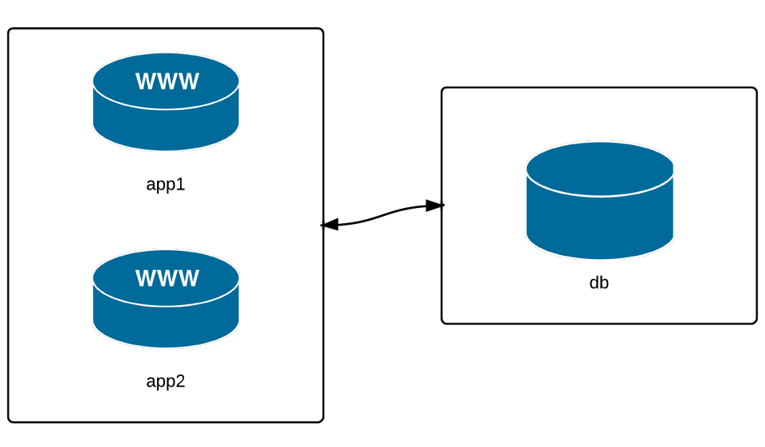

You will see the infra here




Some ad-hoc command (For more details about params and options of the ansible command, type `ansible -h`)

```bash
# Get the hostname of each hosts in multi group
ansible multi -a "hostname" -f 1
# -a : args
# hostname : the action to run
# -f : Fork (Specify the number of parallel processes to use (default=5))

# Check available disk space on the servers
ansible multi -a "df -h" -f1

# Checkout available RAM memory
ansible multi -a "free -h" -f1

# Checkout date and time
ansible multi -a "date" -f 1

# Check the version of a package
ansible multi -m shell -a "python3 --version"

# To get a list of all echaustive details related to a host, you can use the command bellow
ansible [host-or-group] -m setup 


#### Make change using ansible modules 
# Update and upgrade all packages
 ansible-venv/bin/ansible  multi -m dnf -a "name=* state=latest"


# Install chrony 
ansible multi -b -m dnf -a "name=chrony state=present enabled=yes"
ansible multi -b -m service -a "name=chronyd enabled=yes state=started"

# Check if our servers are in time
ansible multi -b -a "chronyc tracking"

# To know witch NTP service is used on a server 
ps aux | grep -E 'chrony|ntpd|systemd-timesyncd'
```

##### Configure groups of servers, or individual servers 
###### Configure the Application servers
Here, we will work based on our architecture
```bash
# Install django
# NB: Based on you python version installed your installation proccess might be different
# ansible app -b -m dnf -a "name=python3-pip state=present"
# ansible app -b -m pip -a "executable=pip3 name=django<4 state=present"

ansible app -b -m dnf -a "name=python3.12-pip state=present" || ansible app -b -m shell -a "python3 -m ensurepip && python3 -m pip install --upgrade pip"
ansible app -b -m pip -a "executable=pip3 name=django<4 state=present"

# Check to make sure Django is working correctly
ansible app -a "python3 -m django --version"
```

###### Configure the Database servers
```bash
# Install mariad and started it
ansible db -b -m dnf -a "name=mariadb-server state=present"
ansible db -b -m service -a "name=mariadb state=started enabled=yes"

# COnfigure the system firewall to ensure that only the system can access the database
ansible db -b -m dnf -a "name=firewalld state=present"
ansible db -b -m service -a "name=firewalld state=started enabled=yes"
 ansible db -b -m firewalld -a "zone=database state=present permanent=yes"
 ansible db -b -m firewalld -a "source=192.168.56.0/24 zone=database state=enabled permanent=yes"
 ansible db -b -m firewalld -a "port=3306/tcp zone=database state=enabled permanent=yes"

# Configure MariaDB 
 ansible db -b -m dnf -a "name=python3-PyMySQL state=present"
 ansible db -b -m community.mysql.mysql_user -a "name=django host=% password=12345 priv=*.*:ALL state=present"

# take a look at p32 i section
```

###### Make changes to just one server
```bash
# let's just take an ipotetycally example, suppose you run a command on a group of 2 hosts to just realize that the command just work on one.
# Ex
ansible app -b -a "systemctl status chronyd"

# Then, you decided to run it agaist the affected server
ansible app -b -a "service chronyd restart" --limit "192.168.56.4"
# Or you can use a syntax like this
# Limit hosts with a simple pattern (asterisk is a wildcard).
$ ansible app -b -a "service chronyd restart" --limit "*.4"
# Limit hosts with a regular expression (prefix with a tilde).
$ ansible app -b -a "service chronyd restart" --limit ~".*\.4"
# The best way to deal with this kind of situation is to add your hosts in a new group and use the standard ansible command
ansible [host-group-name] -m module ...
```

###### Manage users and groups
[Link to the user module](https://docs.ansible.com/ansible/latest/collections/ansible/builtin/user_module.html)
```bash
# add an admin group on the `app` servers for the server administrators
ansible app -b -m group -a "name=admin state=present"
# The group module is pretty simple; you can remove a group by setting state=absent, set a group id with gid=[gid], and indicate that the group is a system group with system=yes

# Add the user johndoe in the new group we created and give him a default home folder
ansible app -b -m user -a "name=johndoe group=admin createhome=yes"
# We have access a to set of options that we can use to 
# create a password for the user : password=[encrypted-password]
# generate SSH key for the user : generate_ssh_key=yes
# define a default SHELL for the user : shell=[shell]
# define the UID of the user : uuid=[uuid]

# Delete a user account
ansible app -b -m user -a "name=johndoe state=absent remove=yes"

```

###### Manage packages
They are various modules to manage package under different kind of linux System. But they are a generic that can be used to install things like `git` on Ubuntu, CentOs, OpenSuse, RHEL, Fedora. The generic manage is called `package` it work the same way as `dnf`, `apt`, `yum`

```bash
# Install git
ansible app -b -m package -a "name=git state=present"
```

###### Manage files and directories

```bash
# To get informations about a file, you can use the module stat
ansible multi -m stat -a "path=/etc/environment"

# Copy file to the servers
ansible multi -m copy -a "src=/etc/hosts dest=/tmp/host"
# Copy an entire directory
ansible multi -m copy -a "src=/absolute-path-to-the-dir dest=/detination-absolute-path"
# Copy only content in a directory without the folder
ansible multi -m copy -a "src=/absolute-path-to-the-dir/ dest=/detination-absolute-path"

# Retrive file from the servers
# Use this command to grab the hosts file from the servers
ansible multi -b -m fetch -a "src=/etc/hosts dest=/tmp"
# The fetched files will be stored like this: /tmp/192.168.56.5/etc/hosts
# So, you will see each server file in that format with the given IP addresses

# If you want to retrive file without the full path to the file, you can do it with the attribute flat=yes
ansible multi -m fetch -a "src=/etc/hosts dest=/tmp flat=yes"
# But it is only usefull if you are fetching file from one server!
# Otherwise, the fetched file will be removed by the last fetch file from your servers

# Create directories and files
ansible multi -m file -a "dest=/tmp/test mode=644 state=directory"

# Create a symlink 
ansible multi -m file -a "src=/tmp/test dest==/tmp/symlink state=link"

# Delete directories and files 
ansible multi -m file -a "src=/path/to-file-or-direcotry state=absent"

# Another useful modules are 
lineinfile, ini_file, and unarchive

```

###### Run operations in the background

View p38
```bash
# Operations like update packages and system might take a few time. It is alway great to have something that can run commands asynchroniously (asynchronously,)  and pool the servers when things finish

# use -B  <max_number of time (in second) to let the job run>
# use -P (--pool) <time interval between each pooling from servers (in second)>
```


###### Update servers asynchronously with asynchronous jobs

```bash
ansible multi -b -B 3600 -P 0 -a "dnf -y update"
# With the option -P 0

# As output, will get something like this
{
  "192.168.56.4": {
    "CHANGED": true,
    "ansible_facts": {
      "discovered_interpreter_python": "/usr/bin/python"
    },
    "ansible_job_id": "333866395772.18507",
    "changed": true,
    "finished": 0,
    "results_file": "/root/.ansible_async/333866395772.18507",
    "started": 1
  },
  "... [other hosts] ..."
}

# To check the status of each servers we can use the `async_status` module
ansible multi -b -m async_status -a "jid=j102895426651.9771"

# For tasks you don’t track remotely, it’s usually a good idea to log the progress of the task somewhere, and also send some sort of alert on failure—especially, for example, when running backgrounded tasks that perform backup operations, or hen running business-critical database maintenance tasks.

# we can also run task in playbook asynchronously by defining an `async` and `poll` parameters on the play.

```


###### Check log files

```bash

# 3 golden rules
# 1- a command like `tail -f` wont work via ansible. SImply bevause, you can't send Ctrl+C to the program to stop it
# 2- don't cat a huge file via Stdout from multiple server, you can strugle dealing with them
# 3- use the shell module, if youi want to perform some filtering operations like `cat file | grep pattern`

# view last line of our message log file from each server
ansible multi -b -a "tail /var/log/messages"

# if you want to perform some filter operation on this file, you should use teh `shell` module
ansible multi -b -m shell -a "tail /var/log/messages | grep ansible-command | wc -l"
ansible multi -b -a "tail /var/log/messages | grep ansible-command | wc -l" # Use the command module and wont work

```

###### Manage cron jobs

Ansible make managing cron job easy with it `cron` module.

```bash
ansible multi -b -m cron -a "name='daily-cron-all-servers' hour=4 job='/path/to/daily-script.sh'"
# Ansible will assume * for all values you don’t specify (valid values are day, hour, minute, month, and weekday).
# You could also specify special time values like reboot,
yearly, or monthly using special_time=[value]
```


---


Example of an ansible task VS bash script
```bash
# The task in aad-hoc mode
ansible multi -b -m service -a "name=chronyd enabled=yes state=started"

#### The bash script
# Start chronyd if it's not already running.
if ps aux | grep -q "[c]hronyd"
then
    echo "chronyd is running." > /dev/null
else
    systemctl start chronyd.service > /dev/null
    echo "Started chronyd."
fi
# Make sure chronyd is enabled on system startup.
systemctl enable chronyd.service

```

Exemple of ansible simple playbook syntax without the name parameter
```yaml
# playboo.yaml
---

- hosts: all
  become: yes
    tasks:
    - dnf: name=chrony state=present
    - service: name=chronyd state=started enabled=yes
```

---

Sysadmin daily tasks

• Apply patches and updates via dnf, apt, and other package managers.
• Check resource usage (disk space, memory, CPU, swap space, network).
• Check log files.
• Manage system users and groups.
• Manage DNS settings, hosts files, etc.
• Copy files to and from servers.
• Deploy applications or run application maintenance.
• Reboot servers.
• Manage cron jobs.


--- 

### Quotes

The best way to prevent disaster, is to know when it could be comming and fix the problem before it happens.
We should use tools like Nagios, Cactic, Munin, Hyperic, to have idea of our server past and present resource usage

If we a running a website or web application available over the internet, we should use tools like: Uptime Robot or PingDom


Most applications are written with slight tolerances for per-server time jitter, but it’s always a good idea to make sure the times on the different servers are as close as possible, and the simplest way to do that is to use the Network Time Protocol.

thorough : approfondi
fare. : tarrif